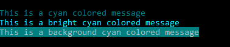
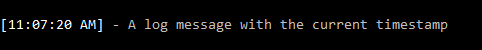
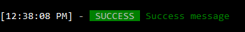

# <span style="font-weight: bold; font-size: 4rem; margin-right: 1rem;">T<span style="font-size: 3rem; color: #f65;">⚙</span>nelog</span> 2.0.0

A Lightweight color logging package for Nodejs.

## Features 🚀

- Easily add colored log messages to your code.
- Beautiful, colorful output for enhanced readability.
- Log message with background color.
- Display current timestamp of log message.
- Supports log levels (success, info, warning, error).
- Typing effect.

## Installation 📦

Install tonelog using npm:<br>

```bash
npm i tonelog
```

## How to use. 🤓

### 1. Adding tone colors to log message

```js
const { tone } = require("tonelog");

console.log(tone.cyan("This is a cyan colored message"));
console.log(tone.bright_cyan("This is a bright cyan colored message"));
console.log(tone.bg_cyan("This is a background cyan colored message"));
```

### Output:



## Available colors 🎨:

### Semantic names:

- success
- info
- warning
- error
- reset

### Major colors

- red
- green
- yellow
- blue
- purple
- cyan
- white

### Bright colors

- bright_red
- bright_green
- bright_yellow
- bright_blue
- bright_purple
- bright_cyan
- bright_white

### Background colors

- bg_black
- bg_red
- bg_green
- bg_yellow
- bg_blue
- bg_purple
- bg_cyan
- bg_white

### Special colors [1]

- orange
- pink
- sky_blue
- brown
- teal
- lavender
- maroon
- olive
- indigo
- gold
- silver

### Special colors [2]

- turquoise
- coral
- lilac
- mint_green
- mustard
- salmon
- chocolate_brown
- pale_pink
- deep_purple
  <br>
  <br>

### 2. Using timestamp

```js
const { useTimestamp } = require("tonelog");

console.log(useTimestamp("A log message with the current timestamp"));
```

### Output:



<br>

### 3. Log Level

```js
const { toneLevel } = require("tonelog");

console.log(
  toneLevel.error("This is an error level log message")
);
```

### Output:


### Log Levels 📊:
- success
- info
- warning
- error

<br>

### Using timestamp with the log level

```js
const { useTimestamp, toneLevel } = require("tonelog");

console.log(
  useTimestamp(
    toneLevel.success("Success message")
  )
);
```

### Output:



<br>

### 4. Typing effect on logging

```js
const { typed } = require("tonelog");

const myArray = [
  "This is the first string on the array",
  "This is the second string on the array",
  "This is the third string on the array",
];

typed(
  myArray,
  1000, // delay time before typing
  70, // Adjust typing speed in milliseconds
  50 // Adjust backspacing speed in milliseconds
);
```

- To log a message after the typing is completed, it is recommended to use the typed function inside of a an async function
  
```js
const { typed } = require("tonelog");

const typing = async () => {
  const myArray = [
    "This is the first string on the array",
    "This is the second string on the array",
    "This is the third string on the array",
  ];

  // Typing...
  await typed(
    myArray,
    1000,
    70,
    50
  );
  console.log("Typing is complete");
};

typing();
```

### or Using ".finanlly()" 
The function returns a promise and ".finanlly()" handles code to be executed after the promise is settled.

```js
const { typed } = require("tonelog");

const myArray = [
  "This is the first string",
  "This is the second string",
  "This is the third string",
];

typed(
  myArray,
  1000, // delay time before typing
  70, // Adjust typing speed in milliseconds
  50 // Adjust backspacing speed in milliseconds
).finally(() => {
  console.log("Typing is complete");
});
```

<br>

### This project is licensed under the MIT License. See the [LICENSE file](./LICENSED.md) for more details.

### Author 📝

- [**Sydney205**](https://github.com/Sydney205)

### Collaborators

- [**Sydney205**](https://github.com/Sydney205)
- [**Emmo00**](https://github.com/Emmo00)

<br>

_Help make <span style="color: #f65; font-weight:bold;">Tonelog</span> better, feel free to contribute, report issues, or provide feedback! Enjoy logging with Tonelog!_ 🎨
